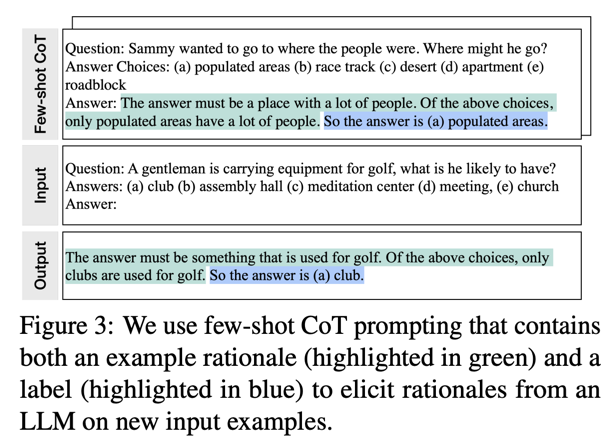

Papers
* [Distilling the Knowledge in a Neural Network](https://arxiv.org/abs/1503.02531), 2015
* [Distilling Step-by-Step! Outperforming Larger Language Models with Less Training Data and Smaller Model Sizes](https://arxiv.org/abs/2305.02301), 2023

🤔 I think the key point, from both papers, is that we want match the small model's output distribution to the teacher's. Simply matching the labels may result in a narrow distribution that does not generalize well.

## Distilling the Knowledge in a Neural Network

(🤔See a trained model as a function that maps input $x$ to output $y$, not just trained parameters): We tend to identify the knowledge in a trained model with the learned parameter values and this makes it hard to see how we can change the form of the model but keep the same knowledge. A more abstract view of the knowledge, that frees it from any particular instantiation, is that it is **a learned mapping from input vectors to output vectors**.

(🤔Relative probabilities of incorrect answers help generalization) The normal training objective is to maximize the average log probability of the correct answer, but a side-effect of learning is that the trained model assigns probabilities to all of the incorrect answers and even when these probabilities are very small, some of them are much larger than others. **The relative probabilities of incorrect answer tells us a lot about how the cumbersome model tends to generalize**. 

### Distillation
Typically, the output distribution $q_i$, computed from raw logits $z_i$, where $T$ is a temperature:

$\displaystyle q_i = \frac{exp(z_i/T)}{\sum_jexp(z_j/T)}$

In the simplest form, knowledge is transferred by training the small model on a transfer dataset and using the soft target distribution produced by the cumbersome model with a high temperature $T$ in its softmax. (🤔 increase temperature to learn the relative probabilities of incorrect answers, or in other words, **similarity structure**.)

When the true labels are known for all or some of the transfer set, we can use **a weighted average of two objective function**:
* first is the cross entropy with the soft targets, using a higher temperature $T > 1$. (🤔 Is kl divergence better in this case? from the description above, kl divergence helps to learn the similarity structure and as a result better generalization.)
* second is the cross entropy with the true label, using $T = 1$

We found the best results were generally obtained by using **a considerably low weight on the second objective function**.

Note: **the magnitudes of the gradients produced by the soft targets scale as $\frac{1}{T^2}$, it is important to multiply them by $T^2$ _when using both hard and soft targets_**. This ensures that the relative contribution of the hard and soft targets remain roughly unchanged if the temperature used for distillation is changed while experimenting with meta-parameters.
(🤔 In other words, we should multiply the weight on the first objective by $T^2$.)

Write some code to help understand.
```python
from torch import nn
from torch.nn import functional as F

def loss(logits, lm_logits, labels, temperature, alpha):
    """
    logits: small model output logits
    lm_logits: large model output logits
    temperature: temperature
    alpha: weight of the cross entropy with the true label, like 0.1?
    """
    p = F.log_softmax(logits/temperature, dim=1)
    q = F.softmax(lm_logits/temperature, dim=1)
    loss1 = nn.KLDivLoss(reduction="batchmean")(p, q)
    loss2 = F.cross_entorpy(logits, labels)
    loss = alpha * loss2 + ((1 -  alpha) * temperature ** 2) * loss1
    return loss
```

## Distilling Step-by-Step

(🤔 Key idea of this paper: Use CoT with user-provided rationales to elicit and extract rationales from a teacher LLM, and train the smaller model to also generate rationales, i.e., reasoning steps, to improve performance.)

A simple mechanism for training smaller models with less training data.

Core to our mechanism is changing our perspective from viewing LLMs as a source of noisy labels to viewing them as **agents that can reason**: LLMs can produce natural language rationales justifying their predicted labels. **These rationales can contain relevant task knowledge, that may originally require many data for small task-specific models to learn**. We thus utilize these extracted rationales as additional, richer information to train small models through a multi-task training setup, with both label prediction and rationale prediction tasks.

The framework has two steps, rationale extraction and training.

### Rationale Extraction
First, given a LLM and an **unlabeled** dataset, we use Chain-of-Thought (CoT) prompting to elicit and extract rationales from LLMs.



Each prompt is a triplet $(x^p, r^p, y^p)$ where $x^p$ is an input, $y^p$ is the label, and $r^p$ is a **user-provided rationale** that explains why $x^p$ can be categorized as $y^p$. With the demonstration seen in $p$, the LLM is able to mimic the triplet demonstration to generate the rationale $\hat{r}_i$ and output $\hat{y}_i$ for input $x_i$.

### Training
Second, **leverage these rationales in addition to task labels** to train smaller downstream models. Intuitively, rationales provide richer, more detailed information about why an input is mapped to an output label, and often contain relevant task knowledge that may be hard to infer solely from the original inputs.

#### Standard finetuning and task distillation

The most common practice to train a task-specific model is to finetune a pretrained model with supervised data. In the absence of labels, task-specific distillation uses LLM teachers to generate noisy training labels, $\hat{y}_i$ in place of $y_i$.

Then the smaller model $f$ is trained to minimize:

$\displaystyle L_{label} = \frac{1}{N}\sum^N_{i=1}\ell(f(x_i), \hat{y}_i)$

where $\ell$ is the cross-entropy loss between the predicted and target tokens.
Here $\hat{y}_i$ could be either true label or teacher LLM-predicted label.

#### This paper
**We use extracted $\hat{r}_i$ as additional supervision**.

A straight forward approach to utilize rationales $\hat{r}_i$ is to feed as additional input:

$\displaystyle L = \frac{1}{N}\sum^N_{i=1}\ell(f(x_i, \hat{r}_i), \hat{y}_i)$

But the problem is that we would need a large LLM running during production to generate $\hat{r}_i$ as input to the small model.

In this work, we train the model $f(x_i) \to (\hat{y}_i, \hat{r}_i)$, i.e., **use the rationale as a target rather than an input**.

$L = L_{label} + \lambda L_{rationale}$

where $L_{label}$ is the label prediction loss as above and $L_{rationale}$ is the rationale generation loss:

$\displaystyle L_{rationale} = \frac{1}{N}\sum^N_{i=1}\ell(f(x_i), \hat{r}_i)$

The rationale generation loss enables the model to learn to generate the reasoning steps for the prediction, and could guide the model in better predicting the resultant label.

Specifically, we prepend "task prefixes" ([label], [rationale]) to the input examples and train the smaller model to output $\hat{y}_i$ when [label] is provided and to produce $\hat{r}_i$ with [rationale].


