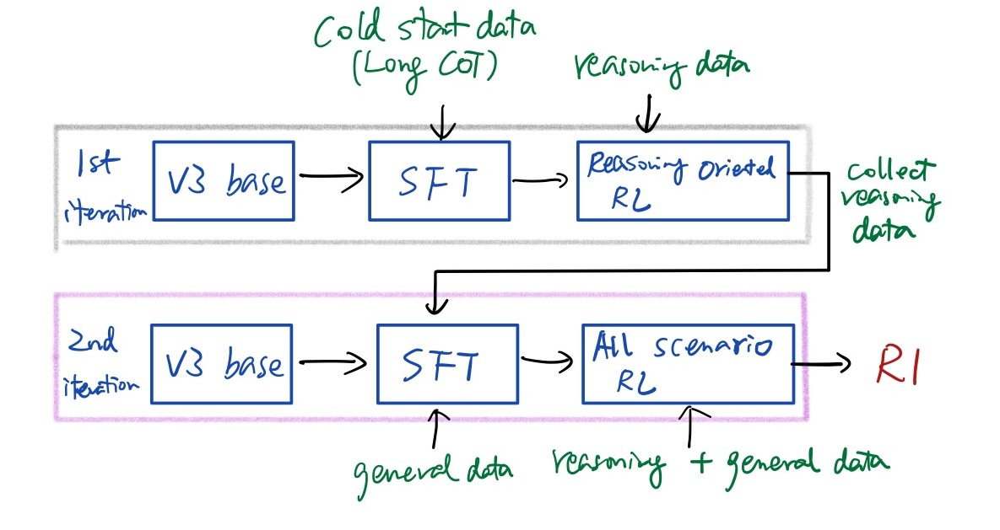

Focus on the post-training pipeline and data curation. 

🤔common patterns in DeekSeek's training
* Iterative
* Reasoning oriented data generation (for SFT & RL) is critical
  * typically uses a more powerful model to generate CoT responses, focusing on accuracy
  * responses that are encourage readability, clarity, etc. are included 

## DeepSeek V3
The post training pipeline is depicted as follows.

### V3 SFT
#### Reasoning data curation
For each domain, such as code, math, or general reasoning, an expert model, later used as data generator, is trained by following the base + SFT + RL procedure. 

After expert SFT, two types of samples are generated for expert RL:
* \<problem, original response\>, focusing on readability and clarity. (🤔generated from expert SFT? How the responses are guaranteed to have readability and clarity? )
* \<system prompt, problem, DeepSeek R1 response\>, focusing on accuracy, where the prompt includes instructions on reflection and verification. 

During expert RL, model uses high-temperature sampling (🤔T > 1) to generate responses that integrate patterns from the two types of samples generated above. 

After the domain experts are trained, rejection sample them to curate high quality data. 

#### General data curation
DeepSeek V2.5 is used to generate responses, followed by human annotator's verification.

#### V3 SFT Training
finetune V3-base for 2 epochs using SFT datasets
cosine decay learning rate. initial lr 5e-6, minimum lr 1e-6.

### V3 RL
GRPO algorithm.
Diverse distribution of prompts, including reasoning and general questions.  

The key in RL is reward modeling.

🤔 Use rule-based reward as much as possible, since the math verifier, code compiler are like "real environment", resistant to reward hacking.

Model based RM, initialized from V3 SFT checkpoint. 
* for questions with free-form ground-truth answers, reward model determines whether the response matches the expected ground-truth. (🤔 question answering, Tldr, etc. But how to compute the distance between answer and response? like dot product of embeddings? )
* for questions without ground-truth, like creative writing, reward model provides feedback (🤔 reward model trained to give a scalar score?)

🤔 Also, it reads like the accepted answer in a preference pair data point includes chain-of-thought to encourage model to follow.  

## DeepSeek R1-zero
R1-zero is built by conducting RL finetuning on a base model directly, without SFT.
### R1-zero RL finetuning
Use GRPO algorithm.

The reward consists two parts:
* reward from a "real environment" like a Math question verifier, or a code compiler
* reward from a trained format reward model that enforces the output in pre-defined tags, \<think\>, \<answer\>.

My understandings here: 🤔
* Because the reward is from a "real environment", that's why the paper says it conducts RL training without any supervised data.
* Only works for math questions, code, etc. that have clear solutions to get a reward score.
### training template
A training template is designed to guide the model to first produce a reasoning process, followed by the final answer.
The template contains instructions **only on structural format**, avoiding any content-specific prompts, like reflective reasoning or any particular strategies.
### Drawbacks
R1-zero has several issues, for instance readability and language mixing. 

## DeepSeek R1
The paper says it employs a 4 stage pipeline. 

I understand there are two iterations: 🤔
* First iteration is reasoning oriented, SFT + RL to train a model to generate reasoning training data
* Second, SFT + RL to re-train a base model on a wide range of data distribution

### R1 post training first iteration
The goal of this iteration is to generate reasoning data for the second iteration.

#### Collect human-friendly cold start data and do SFT
First step, collect a cold start dataset consisting thousands of **long CoT of high quality**:
* using few-shot prompting with a long CoT as an example
* directly prompting models to generate detailed answers with reflection and verification
* gather R1-zero outputs in a readable format
finally refining results through post-processing by human labellers.
 (🤔 which model is prompted to get the samples?)

Second step, Use the cold start data to do SFT on a base model.

The advantages of cold start data:
* better readability
* better performance by carefully designing the pattern for cold start data with human priors.

#### Reasoning-oriented RL like R1-zero
Same large-scale RL training as employed in R1-zero, focus on reasoning capabilities.

In addition, a language consistency reward is introduced, calculating the proportion of target language words in the CoT.

#### Collect data for next iteration SFT
For reasoning data:
* rejection sampling the currently RL trained model
* expand the dataset distribution by incorporate more data, some uses **a generative reward model** by feeding the ground-truth and model predictions into Deepseek-v3 for judgement. (🤔 why feed into V3 model if the ground-truth is known? )
* filter out samples with mixed languages, long paragraphs and code blocks.
* Multiple responses are sampled for each question, and only the correct ones are kept.

Non-reasoning data
* adopt DeepSeek-v3 pipeline and reuse portions of the SFT dataset
* call DeepSeek-v3 to generate CoT before answering the question by prompting. (🤔 sounds like the currently trained RL model is prompted to generate responses, but provide V3 CoT in the prompt.)

### R1 post training second iteration
First, SFT finetune a base model for two epochs using the data collected in the last iteration.

Second, RL finetune again. Reward signals include:
* For reasoning data, same as R1-zero
* For non-reasoning data, use a trained reward model aligned with human preference

